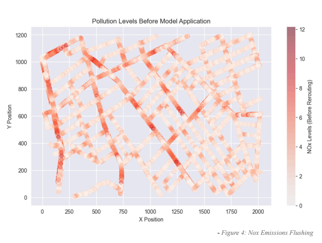
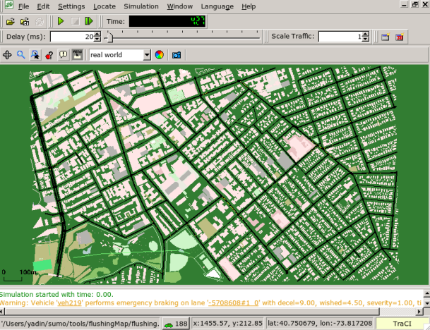
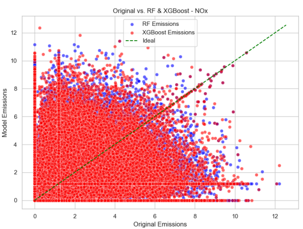

# Car Emission & Air Pollution Reduction using ML and SUMO

## Overview
This project aims to analyze and reduce air pollution and traffic congestion using **SUMO (Simulation of Urban MObility)** and **Machine Learning (ML)**. The simulation collects emissions and traffic data, which are then used to train predictive models for optimizing traffic flow and minimizing pollution levels.

## Features
- **Traffic Simulation**: Uses SUMO to generate urban traffic scenarios.
- **Data Collection**: Extracts emissions data such as CO2, NOx, and PMx levels from SUMO.
- **Machine Learning Analysis**: Applies ML models to predict high-emission zones and suggest rerouting strategies.
- **Visualization**: Generates plots for emissions trends and traffic congestion levels.

## Installation
### Prerequisites
Ensure you have the following installed:
- Python 3.7+
- SUMO (Simulation of Urban MObility)
- Required Python libraries:
  ```bash
  pip install pandas numpy matplotlib seaborn traci
  ```

## Usage
1. **Run SUMO Simulation**
   ```python
   import traci
   traci.start(["sumo-gui", "-c", "flushing.sumocfg", "--start"])
   ```
2. **Collect Emission Data**
   ```python
   df = pd.read_csv("emissions.xml")
   ```
3. **Train ML Model & Analyze Data**
   ```python
   from sklearn.ensemble import RandomForestRegressor
   model = RandomForestRegressor()
   model.fit(X_train, y_train)
   ```
4. **Visualize the Results**
   ```python
   import matplotlib.pyplot as plt
   plt.scatter(df['X'], df['Y'], c=df['NOx'])
   plt.show()
   ```

## Sample Visualizations
### Traffic Emissions over Time


### NOx Concentration Map


### Predicted vs Actual Pollution Levels


## Contributors
- **Billy M Kyaw**
- **Mohammed Y Hossein**

## License
This project is licensed under the MIT License.

